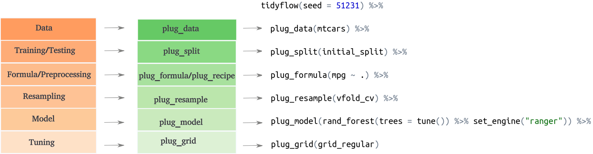

<!-- README.md is generated from README.Rmd. Please edit that file -->

```{r, include = FALSE}
knitr::opts_chunk$set(
  collapse = TRUE,
  comment = "#>",
  fig.path = "man/figures/README-",
  out.width = "100%"
)
```

# tidyflow

<!-- badges: start -->
[](https://github.com/cimentadaj/tidyflow/actions)
[](https://codecov.io/gh/cimentadaj/tidyflow?branch=master)
<!-- badges: end -->

## What is a tidyflow? 

A tidyflow is a fork of [workflows](https://workflows.tidymodels.org/) that can bundle together your data, splitting, resampling, preprocessing, modeling, and grid search. Having all these steps separated into different objects can prove to be difficult. One can predict on the testing data by mistake, forget whether the recipe has been baked or not, or simply do not remember the name of all the tuning parameters to specify in the grid. `tidyflow` is a package aimed at bundling all of these steps into a coherent flow, as is represented below:



Among the advantages are:

 * You don't have to keep track of separate objects in your workspace.

 * The split, resample, recipe prepping, model fitting and grid search can be executed using a single call to `fit()`.
 
## Installation

You can install the development version from [GitHub](https://github.com/) with: 

```{r, eval = FALSE}
# install.packages("devtools")
devtools::install_github("cimentadaj/tidyflow")
```
 
## Example

`tidyflow` builds upon the work in `tidymodels` to create an expressive workflow for doing machine learning. Let's suppose we want to fit a linear model to the model `mpg ~ .` on the training data of `mtcars`. We can define the split (training/testing), define our formula, define the statistical model and fit the tidyflow:

```{r, message = FALSE, eval = FALSE}
library(tidymodels)
library(tidyflow)
```

```{r, echo = FALSE, message = FALSE}
library(rsample)
library(tune)
library(parsnip)
library(rsample)
library(dials)
library(tidyflow)
```

```{r}
# Build tidyflow
tflow <-
  mtcars %>%
  tidyflow() %>%
  plug_split(initial_split) %>%
  plug_formula(mpg ~ .) %>%
  plug_model(linear_reg() %>% set_engine("lm"))

# Fit model
fit_m <- fit(tflow)

fit_m
```

`tidyflow` will execute this order of steps: data -> split training/testing -> apply the formula and model to the training data. With this final model we can use the `predict_training` function to automatically predict on the training data:

```{r}
# Predict on testing
fit_m %>%
  predict_training()
```

Similarly, you can use `predict_testing` for predicting on the testing data.

However, the usefulness of `tidyflow` is clearer when we perform more complex modelling. Let's extend the previous model to include a cross-validation resample and to perform a grid search for a regularized regression:

```{r}
# Grid search will be performed on the penalty and mixture arguments
regularized_mod <- linear_reg(penalty = tune(), mixture = tune()) %>% set_engine("glmnet")

# Build tidyflow
tflow <-
  mtcars %>% # Start with the data
  tidyflow() %>%
  plug_split(initial_split) %>% # Split into training/testing
  plug_formula(mpg ~ .) %>% # Define model specification
  plug_resample(vfold_cv) %>% # Specify resample: cross-validation
  plug_grid(grid_regular) %>%  # Define type of grid search
  plug_model(regularized_mod) # Define the type of model

# Fit model
fit_m <- fit(tflow)
fit_m
```

The result is **not** a final model as before, but rather a grid search result. We can extract that and visualize it:

```{r}
# Extract tuning grid
fit_m %>%
  pull_tflow_fit_tuning() %>%
  autoplot()
```

You can finalize the `tidyflow` with `complete_tflow` which will select the best tuning parameters and train the model on the entire training data. This final model can be used for predicting on the training data and on the testing data automatically:

```{r}
# Fit best model on the entire training data
final_m <-
  fit_m %>%
  complete_tflow(metric = "rmse")

# Predict on train
final_m %>%
  predict_training()

# Predict on testing
final_m %>%
  predict_testing()
```

## Code of Conduct

Please note that the tidyflow project is released with a [Contributor Code of Conduct](https://contributor-covenant.org/version/2/0/CODE_OF_CONDUCT.html). By contributing to this project, you agree to abide by its terms.
