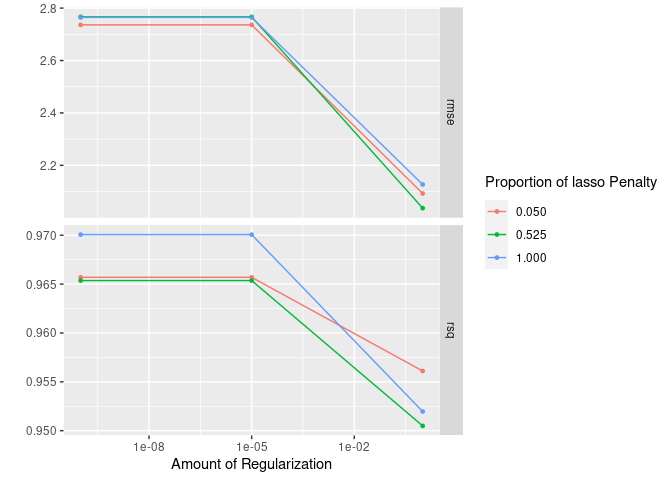

<!-- README.md is generated from README.Rmd. Please edit that file -->

# tidyflow

<!-- badges: start -->

[](https://github.com/cimentadaj/tidyflow/actions)
[](https://codecov.io/gh/cimentadaj/tidyflow?branch=master)
<!-- badges: end -->

## What is a tidyflow?

A tidyflow is a fork of [workflows](https://workflows.tidymodels.org/)
that can bundle together your data, splitting, resampling,
preprocessing, modeling, and grid search. Having all these steps
separated into different objects can prove to be difficult. One can
predict on the testing data by mistake, forget whether the recipe has
been baked or not, or simply do not remember the name of all the tuning
parameters to specify in the grid. `tidyflow` is a package aimed at
bundling all of these steps into a coherent flow, as is represented
below:


Among the advantages are:

  - You don’t have to keep track of separate objects in your workspace.

  - The split, resample, recipe prepping, model fitting and grid search
    can be executed using a single call to `fit()`.

## Installation

You can install the development version from
[GitHub](https://github.com/) with:

``` r
# install.packages("devtools")
devtools::install_github("cimentadaj/tidyflow")
```

## Example

`tidyflow` builds upon the work in `tidymodels` to create an expressive
workflow for doing machine learning. Let’s suppose we want to fit a
linear model to the model `mpg ~ .` on the training data of `mtcars`. We
can define the split (training/testing), define our formula, define the
statistical model and fit the tidyflow:

``` r
library(tidymodels)
library(tidyflow)
```

``` r
# Build tidyflow
tflow <-
  mtcars %>%
  tidyflow() %>%
  plug_split(initial_split) %>%
  plug_formula(mpg ~ .) %>%
  plug_model(linear_reg() %>% set_engine("lm"))

# Fit model
fit_m <- fit(tflow)

fit_m
#> ══ Tidyflow [trained] ══════════════════════════════════════════════════════════
#> Data: 32 rows x 11 columns
#> Split: initial_split w/ default args
#> Formula: mpg ~ .
#> Resample: None
#> Grid: None
#> Model:
#> Linear Regression Model Specification (regression)
#> 
#> Computational engine: lm 
#> 
#> ══ Results ═════════════════════════════════════════════════════════════════════
#> 
#> 
#> Fitted model:
#> 
#> Call:
#> stats::lm(formula = ..y ~ ., data = data)
#> 
#> Coefficients:
#> 
#> ...
#> and 5 more lines.
```

`tidyflow` will execute this order of steps: data -\> split
training/testing -\> apply the formula and model to the training data.
With this final model we can use the `predict_training` function to
automatically predict on the training data:

``` r
# Predict on testing
fit_m %>%
  predict_training()
#> # A tibble: 24 x 12
#>      mpg   cyl  disp    hp  drat    wt  qsec    vs    am  gear  carb .pred
#>    <dbl> <dbl> <dbl> <dbl> <dbl> <dbl> <dbl> <dbl> <dbl> <dbl> <dbl> <dbl>
#>  1  21       6  160    110  3.9   2.62  16.5     0     1     4     4  22.9
#>  2  22.8     4  108     93  3.85  2.32  18.6     1     1     4     1  25.4
#>  3  21.4     6  258    110  3.08  3.22  19.4     1     0     3     1  22.0
#>  4  18.7     8  360    175  3.15  3.44  17.0     0     0     3     2  18.4
#>  5  24.4     4  147.    62  3.69  3.19  20       1     0     4     2  23.0
#>  6  22.8     4  141.    95  3.92  3.15  22.9     1     0     4     2  24.1
#>  7  19.2     6  168.   123  3.92  3.44  18.3     1     0     4     4  18.6
#>  8  17.8     6  168.   123  3.92  3.44  18.9     1     0     4     4  19.1
#>  9  17.3     8  276.   180  3.07  3.73  17.6     0     0     3     3  15.2
#> 10  15.2     8  276.   180  3.07  3.78  18       0     0     3     3  15.3
#> # … with 14 more rows
```

Similarly, you can use `predict_testing` for predicting on the testing
data.

However, the usefulness of `tidyflow` is clearer when we perform more
complex modelling. Let’s extend the previous model to include a
cross-validation resample and to perform a grid search for a regularized
regression:

``` r
# Grid search will be performed on the penalty and mixture arguments
regularized_mod <- linear_reg(penalty = tune(), mixture = tune()) %>% set_engine("glmnet")

# Build tidyflow
tflow <-
  mtcars %>% # Start with the data
  tidyflow() %>%
  plug_split(initial_split) %>% # Split into training/testing
  plug_formula(mpg ~ .) %>% # Define model specification
  plug_resample(vfold_cv) %>% # Specify resample: cross-validation
  plug_grid(grid_regular) %>%  # Define type of grid search
  plug_model(regularized_mod) # Define the type of model

# Fit model
fit_m <- fit(tflow)
fit_m
#> ══ Tidyflow [tuned] ════════════════════════════════════════════════════════════
#> Data: 32 rows x 11 columns
#> Split: initial_split w/ default args
#> Formula: mpg ~ .
#> Resample: vfold_cv w/ default args
#> Grid: grid_regular w/ default args
#> Model:
#> Linear Regression Model Specification (regression)
#> 
#> Main Arguments:
#>   penalty = tune()
#>   mixture = tune()
#> 
#> Computational engine: glmnet 
#> 
#> ══ Results ═════════════════════════════════════════════════════════════════════
#> 
#> Tuning results: 
#> 
#> # A tibble: 5 x 4
#>   splits         id     .metrics          .notes          
#>   <list>         <chr>  <list>            <list>          
#> 1 <split [21/3]> Fold01 <tibble [18 × 6]> <tibble [0 × 1]>
#> 2 <split [21/3]> Fold02 <tibble [18 × 6]> <tibble [0 × 1]>
#> 3 <split [21/3]> Fold03 <tibble [18 × 6]> <tibble [0 × 1]>
#> 4 <split [21/3]> Fold04 <tibble [18 × 6]> <tibble [0 × 1]>
#> 5 <split [22/2]> Fold05 <tibble [18 × 6]> <tibble [0 × 1]>
#> 
#> ... and 5 more lines.
```

The result is **not** a final model as before, but rather a grid search
result. We can extract that and visualize it:

``` r
# Extract tuning grid
fit_m %>%
  pull_tflow_fit_tuning() %>%
  autoplot()
```



You can finalize the `tidyflow` with `complete_tflow` which will select
the best tuning parameters and train the model on the entire training
data. This final model can be used for predicting on the training data
and on the testing data automatically:

``` r
# Fit best model on the entire training data
final_m <-
  fit_m %>%
  complete_tflow(metric = "rmse")

# Predict on train
final_m %>%
  predict_training()
#> # A tibble: 24 x 12
#>      mpg   cyl  disp    hp  drat    wt  qsec    vs    am  gear  carb .pred
#>    <dbl> <dbl> <dbl> <dbl> <dbl> <dbl> <dbl> <dbl> <dbl> <dbl> <dbl> <dbl>
#>  1  21       6  160    110  3.9   2.62  16.5     0     1     4     4  22.5
#>  2  21       6  160    110  3.9   2.88  17.0     0     1     4     4  22.1
#>  3  21.4     6  258    110  3.08  3.22  19.4     1     0     3     1  20.6
#>  4  18.7     8  360    175  3.15  3.44  17.0     0     0     3     2  16.6
#>  5  18.1     6  225    105  2.76  3.46  20.2     1     0     3     1  20.3
#>  6  14.3     8  360    245  3.21  3.57  15.8     0     0     3     4  14.1
#>  7  24.4     4  147.    62  3.69  3.19  20       1     0     4     2  22.7
#>  8  22.8     4  141.    95  3.92  3.15  22.9     1     0     4     2  23.4
#>  9  17.8     6  168.   123  3.92  3.44  18.9     1     0     4     4  19.6
#> 10  16.4     8  276.   180  3.07  4.07  17.4     0     0     3     3  15.3
#> # … with 14 more rows

# Predict on testing
final_m %>%
  predict_testing()
#> # A tibble: 8 x 12
#>     mpg   cyl  disp    hp  drat    wt  qsec    vs    am  gear  carb .pred
#>   <dbl> <dbl> <dbl> <dbl> <dbl> <dbl> <dbl> <dbl> <dbl> <dbl> <dbl> <dbl>
#> 1  22.8     4 108      93  3.85  2.32  18.6     1     1     4     1  26.9
#> 2  19.2     6 168.    123  3.92  3.44  18.3     1     0     4     4  19.5
#> 3  14.7     8 440     230  3.23  5.34  17.4     0     0     3     4  10.7
#> 4  15.2     8 304     150  3.15  3.44  17.3     0     0     3     2  17.3
#> 5  13.3     8 350     245  3.73  3.84  15.4     0     0     3     4  14.0
#> 6  19.2     8 400     175  3.08  3.84  17.0     0     0     3     2  15.5
#> 7  27.3     4  79      66  4.08  1.94  18.9     1     1     4     1  28.4
#> 8  30.4     4  95.1   113  3.77  1.51  16.9     1     1     5     2  27.3
```

## Code of Conduct

Please note that the tidyflow project is released with a [Contributor
Code of
Conduct](https://contributor-covenant.org/version/2/0/CODE_OF_CONDUCT.html).
By contributing to this project, you agree to abide by its terms.
