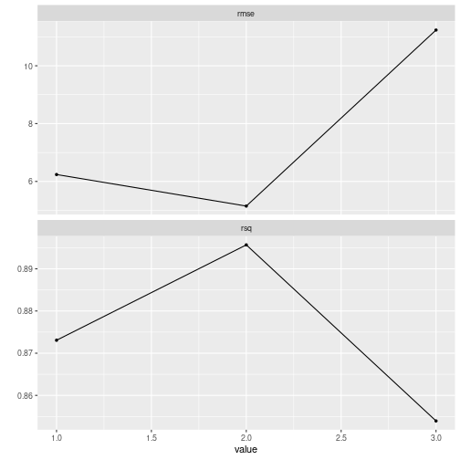

This vignette aims to exemplify how you can use recipes within a `tidyflow`.

A tidyflow is a bundle of steps that allow you to bundle together your data, splitting, resampling, preprocessing, modeling, and grid search. For preprocessing your data, the `tidymodels` ecosystem contains the `recipes` package. This package allows to create very concise and clean pipelines of transforming your data. Let's create a very simple recipe that takes the logarithm of the variable `qsec`:


```r
library(tidymodels)
library(tidyflow)
```


```r
rcp <-
  mtcars %>%
  recipe(mpg ~ .) %>%
  step_log(qsec)
  
rcp
#> Data Recipe
#> 
#> Inputs:
#> 
#>       role #variables
#>    outcome          1
#>  predictor         10
#> 
#> Operations:
#> 
#> Log transformation on qsec
```

The recipe contains the model formula (`mpg ~ .`) and a preprocessing step `step_log(qsec)`. How do we incorporate this in our `tidyflow`? We use `plug_recipe` but we need to change this recipe to be a formula:


```r
rcp <-
  ~ .x %>%
    recipe(mpg ~ .) %>%
    step_log(qsec)

tflow <-
  mtcars %>%
  tidyflow(seed = 5131) %>%
  plug_recipe(rcp)

tflow
#> ══ Tidyflow ════════════════════════════════════════════════════════════════════
#> Data: 32 rows x 11 columns
#> Split: None
#> Recipe: available
#> Resample: None
#> Grid: None
#> Model: None
```

Did you notice that we replace `mtcars` with `.x` and that `.x` has a `~` in front of it? Those are the only two things that changes from our previous recipe. `tidyflow` already knows that `.x` will be the placeholder for the data and will figure out where to place the recipe in the order of execution. 

Having said this, there's no need to specify a formula for the model definition: the recipe already contains this formula! So let's split the data into training and testing and fit a linear regression:


```r
tflow <-
  tflow %>%
  plug_split(initial_split) %>%
  plug_model(linear_reg() %>% set_engine("lm"))

final_model <- tflow %>% fit()

final_model %>%
  pull_tflow_fit()
#> parsnip model object
#> 
#> Fit time:  3ms 
#> 
#> Call:
#> stats::lm(formula = ..y ~ ., data = data)
#> 
#> Coefficients:
#> (Intercept)          cyl         disp           hp         drat           wt  
#>  -35.739311     0.329900     0.003209    -0.015191     1.656429    -2.376667  
#>        qsec           vs           am         gear         carb  
#>   19.316946     0.767142     3.789040     0.074718    -0.278102
```

Defining your preprocessing steps in the recipe has several advantages among which are that the `tidyflow` takes care of applying these preprocessing steps in the training/testing data automatically. You can automatically predict on the training data and expect the `tidyflow` to calculate the log of `qsec` automatically:


```r
final_model %>%
  predict_training()
#> # A tibble: 24 x 12
#>      mpg   cyl  disp    hp  drat    wt  qsec    vs    am  gear  carb .pred
#>    <dbl> <dbl> <dbl> <dbl> <dbl> <dbl> <dbl> <dbl> <dbl> <dbl> <dbl> <dbl>
#>  1  21       6  160    110  3.9   2.62  16.5     0     1     4     4  22.4
#>  2  21       6  160    110  3.9   2.88  17.0     0     1     4     4  22.4
#>  3  21.4     6  258    110  3.08  3.22  19.4     1     0     3     1  20.9
#>  4  18.1     6  225    105  2.76  3.46  20.2     1     0     3     1  20.5
#>  5  14.3     8  360    245  3.21  3.57  15.8     0     0     3     4  13.6
#>  6  24.4     4  147.    62  3.69  3.19  20       1     0     4     2  22.0
#>  7  22.8     4  141.    95  3.92  3.15  22.9     1     0     4     2  24.6
#>  8  19.2     6  168.   123  3.92  3.44  18.3     1     0     4     4  19.3
#>  9  16.4     8  276.   180  3.07  4.07  17.4     0     0     3     3  15.0
#> 10  17.3     8  276.   180  3.07  3.73  17.6     0     0     3     3  16.1
#> # … with 14 more rows
```

Note that the `qsec` column here is untransformed but the model used to predict on the new `.pred` column was indeed logged. How can you be sure? You can extract the transformed training data with `pull_tflow_training` with `prep = TRUE`:


```r
final_model %>%
  pull_tflow_training(prep = TRUE)
#>     mpg cyl  disp  hp drat    wt     qsec vs am gear carb
#> 1  21.0   6 160.0 110 3.90 2.620 2.800933  0  1    4    4
#> 2  21.0   6 160.0 110 3.90 2.875 2.834389  0  1    4    4
#> 3  21.4   6 258.0 110 3.08 3.215 2.967333  1  0    3    1
#> 4  18.1   6 225.0 105 2.76 3.460 3.006672  1  0    3    1
#> 5  14.3   8 360.0 245 3.21 3.570 2.762538  0  0    3    4
#> 6  24.4   4 146.7  62 3.69 3.190 2.995732  1  0    4    2
#> 7  22.8   4 140.8  95 3.92 3.150 3.131137  1  0    4    2
#> 8  19.2   6 167.6 123 3.92 3.440 2.906901  1  0    4    4
#> 9  16.4   8 275.8 180 3.07 4.070 2.856470  0  0    3    3
#> 10 17.3   8 275.8 180 3.07 3.730 2.867899  0  0    3    3
#> 11 15.2   8 275.8 180 3.07 3.780 2.890372  0  0    3    3
#> 12 10.4   8 472.0 205 2.93 5.250 2.889260  0  0    3    4
#> 13 14.7   8 440.0 230 3.23 5.345 2.857619  0  0    3    4
#> 14 32.4   4  78.7  66 4.08 2.200 2.968875  1  1    4    1
#> 15 33.9   4  71.1  65 4.22 1.835 2.990720  1  1    4    1
#> 16 21.5   4 120.1  97 3.70 2.465 2.996232  1  0    3    1
#> 17 15.5   8 318.0 150 2.76 3.520 2.825537  0  0    3    2
#> 18 15.2   8 304.0 150 3.15 3.435 2.850707  0  0    3    2
#> 19 19.2   8 400.0 175 3.08 3.845 2.836150  0  0    3    2
#> 20 27.3   4  79.0  66 4.08 1.935 2.939162  1  1    4    1
#> 21 15.8   8 351.0 264 4.22 3.170 2.674149  0  1    5    4
#> 22 19.7   6 145.0 175 3.62 2.770 2.740840  0  1    5    6
#> 23 15.0   8 301.0 335 3.54 3.570 2.681022  0  1    5    8
#> 24 21.4   4 121.0 109 4.11 2.780 2.923162  1  1    4    2
```

One drawback from the print out of the `tidyflow` is that you can really see the type of preprocessing that was used for fitting the model. `pull_tflow_prepped_recipe` returns the fitted recipe on the final model and contains all the steps used in the recipe:


```r
final_model %>%
  pull_tflow_prepped_recipe()
#> Data Recipe
#> 
#> Inputs:
#> 
#>       role #variables
#>    outcome          1
#>  predictor         10
#> 
#> Training data contained 24 data points and no missing data.
#> 
#> Operations:
#> 
#> Log transformation on qsec [trained]
```

Another advantage of a recipe preprocessing step is that it allows to perform a grid search on values defined in the preprocessing. For example, suppose we want to calculate the polynomial of `sec`. We could try `qsec^2`, `qsec^3`, etc... Until we find a polynomial that maximizes our predictive accuracy. Recipes accept an object called `tune` that signals that we will try many values for a particular argument (polynomials in this case). If you specify a `plug_split`, `tidyflow` can figure out some possible values to use are run the entire grid search for you. For example:


```r
# New recipe that will try many values for degree
# degree here means the polynomial degree.
# For example, qsec^2, qsec^3, etc...
rcp <-
  ~ .x %>%
    recipe(mpg ~ .) %>%
    step_poly(qsec, degree = tune())

final_model <-
  tflow %>% # Reuse the same tidyflow from before
  replace_recipe(rcp) %>% # Replace the recipe with the new one
  plug_resample(vfold_cv) %>% # Plug in the cross-validation for grid search
  plug_grid(grid_regular) %>% # Plug in the type of grid search
  fit()

final_model
#> ══ Tidyflow [tuned] ════════════════════════════════════════════════════════════
#> Data: 32 rows x 11 columns
#> Split: initial_split w/ default args
#> Recipe: available
#> Resample: vfold_cv w/ default args
#> Grid: grid_regular w/ default args
#> Model:
#> Linear Regression Model Specification (regression)
#> 
#> Computational engine: lm 
#> 
#> ══ Results ═════════════════════════════════════════════════════════════════════
#> 
#> Tuning results: 
#> 
#> # A tibble: 5 x 4
#>   splits         id     .metrics         .notes          
#>   <list>         <chr>  <list>           <list>          
#> 1 <split [21/3]> Fold01 <tibble [6 × 5]> <tibble [0 × 1]>
#> 2 <split [21/3]> Fold02 <tibble [6 × 5]> <tibble [0 × 1]>
#> 3 <split [21/3]> Fold03 <tibble [6 × 5]> <tibble [0 × 1]>
#> 4 <split [21/3]> Fold04 <tibble [6 × 5]> <tibble [0 × 1]>
#> 5 <split [22/2]> Fold05 <tibble [6 × 5]> <tibble [0 × 1]>
#> 
#> ... and 5 more lines.
```

The result is now a tuning grid and **not** a final model. As expected, this is because `tidyflow` already fit many models using different values for `degree`. We can explore the performance of the model with this model.


```r
final_model %>%
  pull_tflow_fit_tuning() %>%
  autoplot()
```



The lowest error for both the $RMSE$ and the $R^2$ seems to be a model of `degree = 2`. We can specify this directly into `complete_tflow` or just allow `complete_tflow` to determine this for you:


```r
# Manual approach
best_model <- final_model %>% complete_tflow(best_params = data.frame(degree = 2))

# Allow `complete_tflow` to determine this for you
best_model <- final_model %>% complete_tflow(metric = "rmse")

best_model %>%
  predict_training()
#> # A tibble: 24 x 12
#>      mpg   cyl  disp    hp  drat    wt  qsec    vs    am  gear  carb .pred
#>    <dbl> <dbl> <dbl> <dbl> <dbl> <dbl> <dbl> <dbl> <dbl> <dbl> <dbl> <dbl>
#>  1  21       6  160    110  3.9   2.62  16.5     0     1     4     4  21.0
#>  2  21       6  160    110  3.9   2.88  17.0     0     1     4     4  22.0
#>  3  21.4     6  258    110  3.08  3.22  19.4     1     0     3     1  20.6
#>  4  18.1     6  225    105  2.76  3.46  20.2     1     0     3     1  19.2
#>  5  14.3     8  360    245  3.21  3.57  15.8     0     0     3     4  12.8
#>  6  24.4     4  147.    62  3.69  3.19  20       1     0     4     2  23.2
#>  7  22.8     4  141.    95  3.92  3.15  22.9     1     0     4     2  23.1
#>  8  19.2     6  168.   123  3.92  3.44  18.3     1     0     4     4  19.4
#>  9  16.4     8  276.   180  3.07  4.07  17.4     0     0     3     3  14.4
#> 10  17.3     8  276.   180  3.07  3.73  17.6     0     0     3     3  16.8
#> # … with 14 more rows
```

The `recipes` package and `tidymodels` and very powerful tools for doing machine learning. In this vignette, I tried to extend their work by providing a unified interface for working with `tidymodels` that uses the recipe framework bundled together with all the other common machine learning steps.

Want to see tidyflow and recipes in action? The `tidymodels` team has a vignette showcasing how to use `recipes` and `tidymodels` [here](https://www.tidymodels.org/start/recipes/). I've adapted their code to fully run within a `tidyflow` workflow. Here's the replication code:


```r
library(tidymodels)
library(tidyflow)
library(nycflights13)

## Start initial preprocessing
flight_data <- 
  flights %>% 
  mutate(
    # Convert the arrival delay to a factor
    arr_delay = ifelse(arr_delay >= 30, "late", "on_time"),
    arr_delay = factor(arr_delay),
    # We will use the date (not date-time) in the recipe below
    date = as.Date(time_hour)
  ) %>% 
  # Include the weather data
  inner_join(weather, by = c("origin", "time_hour")) %>% 
  # Only retain the specific columns we will use
  select(dep_time, flight, origin, dest, air_time, distance, 
         carrier, date, arr_delay, time_hour) %>% 
  # Exclude missing data
  na.omit() %>% 
  # For creating models, it is better to have qualitative columns
  # encoded as factors (instead of character strings)
  mutate_if(is.character, as.factor)

## End initial preprocessing

# Model formula and recipe preprocessing
flight_rec <-
  ~ .x %>%
    recipe(arr_delay ~ .) %>% 
    update_role(flight, time_hour, new_role = "ID") %>% 
    step_date(date, features = c("dow", "month")) %>% 
    step_holiday(date, holidays = timeDate::listHolidays("US")) %>% 
    step_rm(date) %>% 
    step_dummy(all_nominal(), -all_outcomes()) %>% 
    step_zv(all_predictors())

# tidyflow preparation with the recipe
tflow <-
  flight_data %>%
  tidyflow(seed = 555) %>%
  plug_split(initial_split, prop = 3/4) %>%
  plug_recipe(flight_rec) %>%
  plug_model(logistic_reg() %>% set_engine("glm"))

# Fit final model
flights_fit <- fit(tflow)

# Predict on testing and evaluate a `roc_curve`
flights_fit %>%
  predict_testing(type = "prob") %>%
  roc_curve(truth = arr_delay, .pred_late) %>% 
  autoplot()
```


