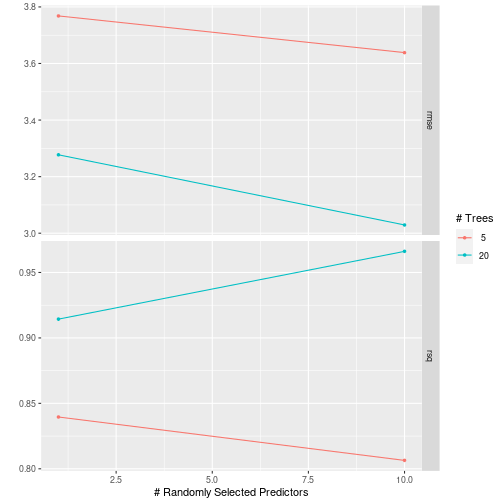

This vignette aims to exemplify how you can use resampling and tuning within a `tidyflow`.

A tidyflow is a bundle of steps that allow you to bundle together your data, splitting, resampling, preprocessing, modeling, and grid search. For executing a grid search, the `tidymodels` ecosystem contains the `tune` package. `tune` allows you to run many sub-models, each one with a different combination of tuning parameters, with the aim of choosing the best final model. 

[In another vignette](./c03_fitting-model-resampling.html), we discussed the concept of resampling and how it can be used to evaluate the stability of a model. For performing a grid search, resampling is a natural step because we need to try a combination of tuning values for each parameter in a model. In other words, we will run many models with different values for the models parameters and we need a way to get random samples from the data. Resampling is thus combined with a general strategy of trying out different sub-models.

Let's define a random forest model but we want to try different values in the `trees` argument. We can signal that with the `tune()` function. This just means that the `trees` will be `tune`d.


```r
library(tidymodels)
library(tidyflow)

rf <- rand_forest(mode = "regression", trees = tune()) %>% set_engine("randomForest")
rf
#> Random Forest Model Specification (regression)
#> 
#> Main Arguments:
#>   trees = tune()
#> 
#> Computational engine: randomForest
```

At this point, we haven't really 'defined' which values will be used for `trees`. It could be 3 values (such as 100, 200 and 300) or it could be 500. The package `tune` hosts a family of functions named `grid_*` which provide different approaches to sampling random number from different tuning arguments. For example, let's use `grid_regular` to obtain an evenly spaced set of values for `trees`. This is how you would do it in `tidymodels`:


```r
even_values <- grid_regular(trees(), levels = 10)
even_values
#> # A tibble: 10 x 1
#>    trees
#>    <int>
#>  1     1
#>  2   223
#>  3   445
#>  4   667
#>  5   889
#>  6  1111
#>  7  1333
#>  8  1555
#>  9  1777
#> 10  2000
```

`grid_regular` already knows which 'sensible' range of values to try. `tidyflow` provides the function `plug_grid` that allows you to specify the type of grid search you want to perform. Let's divide the data into training/testing, specify a cross-validation and plug in the random forest and a `grid_regular`:


```r
tflow <-
  mtcars %>%
  tidyflow(seed = 57136) %>%
  plug_formula(mpg ~ .) %>%
  plug_split(initial_split) %>%
  plug_resample(vfold_cv) %>%
  plug_model(rf) %>%
  plug_grid(grid_regular)

tflow
#> ══ Tidyflow ════════════════════════════════════════════════════════════════════
#> Data: 32 rows x 11 columns
#> Split: initial_split w/ default args
#> Formula: mpg ~ .
#> Resample: vfold_cv w/ default args
#> Grid: grid_regular w/ default args
#> Model:
#> Random Forest Model Specification (regression)
#> 
#> Main Arguments:
#>   trees = tune()
#> 
#> Computational engine: randomForest
```

This grid search specification knows that `trees` is the only argument to be searched for. We can execute the grid search with just a single call to `fit`:


```r
res <- tflow %>% fit()
#> randomForest 4.6-14
#> Type rfNews() to see new features/changes/bug fixes.
#> 
#> Attaching package: 'randomForest'
#> The following object is masked from 'package:ggplot2':
#> 
#>     margin
#> The following object is masked from 'package:dplyr':
#> 
#>     combine
#> ! Fold08: internal: A correlation computation is required, but `estimate` is const...
res %>% pull_tflow_fit_tuning()
#> Warning: This tuning result has notes. Example notes on model fitting include:
#> internal: A correlation computation is required, but `estimate` is constant and has 0 standard deviation, resulting in a divide by 0 error. `NA` will be returned.
#> # Tuning results
#> # 10-fold cross-validation 
#> # A tibble: 10 x 4
#>    splits         id     .metrics         .notes          
#>    <list>         <chr>  <list>           <list>          
#>  1 <split [21/3]> Fold01 <tibble [6 × 5]> <tibble [0 × 1]>
#>  2 <split [21/3]> Fold02 <tibble [6 × 5]> <tibble [0 × 1]>
#>  3 <split [21/3]> Fold03 <tibble [6 × 5]> <tibble [0 × 1]>
#>  4 <split [21/3]> Fold04 <tibble [6 × 5]> <tibble [0 × 1]>
#>  5 <split [22/2]> Fold05 <tibble [6 × 5]> <tibble [0 × 1]>
#>  6 <split [22/2]> Fold06 <tibble [6 × 5]> <tibble [0 × 1]>
#>  7 <split [22/2]> Fold07 <tibble [6 × 5]> <tibble [0 × 1]>
#>  8 <split [22/2]> Fold08 <tibble [6 × 5]> <tibble [1 × 1]>
#>  9 <split [22/2]> Fold09 <tibble [6 × 5]> <tibble [0 × 1]>
#> 10 <split [22/2]> Fold10 <tibble [6 × 5]> <tibble [0 × 1]>
```

The result is a resampling object with the evaluation metrics measuring the performance of different values for `trees` across the 10 resamples. You can look at more clearly the performance of the model using different values for trees using `autoplot()` on the resampling result:


```r
res %>% pull_tflow_fit_tuning() %>% autoplot()
```


It seems the grid randomly chose three values for `trees` (X axis has three points on `1`, `1000` and `2000`) and as expected, as the number of trees increases, the `rsq` is higher and the `rmse` is lower.

This grid search strategy is really just a quick way to get some models running. However, it allows for much more flexibility. For example, we can play around with the number of values to sample from by just providing an extra argument to `plug_grid`:


```r
tflow <-
  mtcars %>%
  tidyflow(seed = 57136) %>%
  plug_formula(mpg ~ .) %>%
  plug_split(initial_split) %>%
  plug_resample(vfold_cv) %>%
  plug_model(rf) %>%
  plug_grid(grid_regular, levels = 10)

tflow %>%
  fit() %>%
  pull_tflow_fit_tuning() %>%
  autoplot()
```


The random grid contains now 10 values. What if we wanted to limit the range of the values used in the resampling?


```r
tflow <-
  mtcars %>%
  tidyflow(seed = 57136) %>%
  plug_formula(mpg ~ .) %>%
  plug_split(initial_split) %>%
  plug_resample(vfold_cv) %>%
  plug_model(rf) %>%
  plug_grid(grid_regular, trees = trees(range = c(1, 20)), levels = 10)

tflow %>%
  fit() %>%
  pull_tflow_fit_tuning() %>%
  autoplot()
```


This approach works just as well with **any** of the `grid_*` functions. However, what if we simply wanted to provide the values to try? That is, we don't want any type of 'random sampling'. `plug_grid` allows the user to specify the function `expand.grid` and just provide the values to be used in the grid search. For example:


```r
tflow <-
  mtcars %>%
  tidyflow(seed = 57136) %>%
  plug_formula(mpg ~ .) %>%
  plug_split(initial_split) %>%
  plug_resample(vfold_cv) %>%
  plug_model(rf) %>%
  plug_grid(expand.grid, trees = c(1, 5, 10))

tflow %>%
  fit() %>%
  pull_tflow_fit_tuning() %>%
  autoplot()
#> Warning: Duplicate rows in grid of tuning combinations found and removed.
#> ! Fold08: internal: A correlation computation is required, but `estimate` is const...
```


This flexibility works just as well with any number of tuning parameters for the model. You can specify as many as parameters as you want, and even manually customize some of the parameters while the `grid_*` functions takes care of randomly sampling the others. For example, let's say we wanted to run a random forest while tuning the parameters `trees`, `min_n` and `mtry`. Suppose that on top of that we wanted to manually limit the range of `trees` to be between 5 and 20, the `min_n` to be `20` (fixed) and allow the grid sampling to sample `mtry` randomly from 'sensible' values. We do that just as we've been manually updating the parameters values in `plug_grid`:


```r
rf <-
  rand_forest(mode = "regression",
              trees = tune(),
              min_n = 20,
              mtry = tune()) %>%
  set_engine("randomForest")

tflow <-
  mtcars %>%
  tidyflow(seed = 57136) %>%
  plug_formula(mpg ~ .) %>%
  plug_split(initial_split) %>%
  plug_resample(vfold_cv) %>%
  plug_model(rf) %>%
  plug_grid(grid_regular, trees = trees(range = c(5, 20)), levels = 2)

res <- fit(tflow)
res %>% pull_tflow_fit_tuning() %>% autoplot()
```



If you want to extract the actual grid used behind the scenes, `pull_tflow_grid` returns exactly that, after the model has been fitted.


```r
res %>% pull_tflow_grid()
#> # A tibble: 4 x 2
#>    mtry trees
#>   <int> <int>
#> 1     1     5
#> 2    10     5
#> 3     1    20
#> 4    10    20
```

Once you've tuned your model you want to choose the final model. `complete_tflow` takes care of finding by the best combination of values for you. When you provide the metric of interest, it searches for the combination of parameters with the lowest error for your metric:


```r
final_mod <- res %>% complete_tflow(metric = "rmse")

# Otherwise, you can provide the values manually yourself
# best <- data.frame(trees = 10, min_n = 20, mtry = 5)
# final_mod <- res %>% complete_tflow(best_params = best)

final_mod
#> ══ Tidyflow [trained] ══════════════════════════════════════════════════════════
#> Data: 32 rows x 11 columns
#> Split: initial_split w/ default args
#> Formula: mpg ~ .
#> Resample: vfold_cv w/ default args
#> Grid: grid_regular w/ trees = ~trees(range = c(5, 20)), levels = ~2
#> Model:
#> Random Forest Model Specification (regression)
#> 
#> Main Arguments:
#>   mtry = 10
#>   trees = 20
#>   min_n = 20
#> 
#> Computational engine: randomForest 
#> 
#> ══ Results ═════════════════════════════════════════════════════════════════════
#> 
#> Tuning results: 
#> 
#> # A tibble: 5 x 4
#>   splits         id     .metrics         .notes          
#>   <list>         <chr>  <list>           <list>          
#> 1 <split [21/3]> Fold01 <tibble [8 × 6]> <tibble [0 × 1]>
#> 2 <split [21/3]> Fold02 <tibble [8 × 6]> <tibble [0 × 1]>
#> 3 <split [21/3]> Fold03 <tibble [8 × 6]> <tibble [0 × 1]>
#> 4 <split [21/3]> Fold04 <tibble [8 × 6]> <tibble [0 × 1]>
#> 5 <split [22/2]> Fold05 <tibble [8 × 6]> <tibble [0 × 1]>
#> 
#> ... and 5 more lines.
#> 
#> 
#> Fitted model:
#> 
#> Call:
#>  randomForest(x = as.data.frame(x), y = y, ntree = ~20L, mtry = ~10L,      nodesize = ~20) 
#>                Type of random forest: regression
#>                      Number of trees: 20
#> 
#> ...
#> and 4 more lines.
```

`complete_tflow` takes care of fitting the model with the best parameters on the entire training data. Now you can predict on the training or testing data automatically with `predict_training` or `predict_testing`.


```r
final_mod %>%
  predict_training() %>%
  rsq(mpg, .pred)
#> # A tibble: 1 x 3
#>   .metric .estimator .estimate
#>   <chr>   <chr>          <dbl>
#> 1 rsq     standard       0.875
```

The `tune` package and `tidymodels` are very powerful tools for doing machine learning. In this vignette, I tried to extend their work by providing a unified interface for working with `tune` that uses the grid search framework bundled together with all the other common machine learning steps.

Want to see tidyflow and tune in action? The `tidymodels` team has a vignette showcasing how to use `tune` and `tidymodels` [here](https://www.tidymodels.org/start/case-study/). I've adapted their code to fully run within a `tidyflow` workflow. Here's the replication code:


```r
library(tidymodels)
library(tidyflow)
library(readr)       # for importing data
library(vip)         # for variable importance plots
library(readr)

hotels <-
  read_csv("https://tidymodels.org/start/case-study/hotels.csv") %>%
  mutate_if(is.character, as.factor)

lr_mod <- logistic_reg(penalty = tune(), mixture = 1) %>% set_engine("glmnet")

holidays <- c("AllSouls", "AshWednesday", "ChristmasEve", "Easter",
              "ChristmasDay", "GoodFriday", "NewYearsDay", "PalmSunday")

lr_recipe <-
  ~ .x %>%
    recipe(children ~ .) %>%
    step_date(arrival_date) %>%
    step_holiday(arrival_date, holidays = holidays) %>%
    step_rm(arrival_date) %>%
    step_dummy(all_nominal(), -all_outcomes()) %>%
    step_zv(all_predictors()) %>%
    step_normalize(all_predictors())

tflow <-
  hotels %>%
  tidyflow(seed = 123) %>%
  plug_split(initial_split, strata = "children") %>%
  plug_resample(validation_split, strata = "children", prop = 0.8) %>%
  plug_recipe(lr_recipe) %>%
  plug_grid(expand.grid, penalty = 10^seq(-4, -1, length.out = 30)) %>%
  plug_model(lr_mod)

cntrl <- control_tidyflow(control_grid = control_grid(save_pred = TRUE))
p_res <- tflow %>% fit(control = cntrl)

p_res %>%
  pull_tflow_fit_tuning() %>%
  collect_metrics() %>%
  filter(.metric == "roc_auc") %>%
  ggplot(aes(x = penalty, y = mean)) +
  geom_point() +
  geom_line() +
  ylab("Area under the ROC Curve") +
  scale_x_log10(labels = scales::label_number())

top_models <-
  p_res %>%
  pull_tflow_fit_tuning() %>%
  show_best("roc_auc", n = 15) %>%
  arrange(penalty)

lr_best <- top_models %>% slice(12)

lr_auc <-
  p_res %>%
  pull_tflow_fit_tuning() %>%
  collect_predictions(parameters = lr_best) %>%
  roc_curve(children, .pred_children) %>%
  mutate(model = "Logistic Regression")

autoplot(lr_auc)

# Let's run in parallel
cores <- parallel::detectCores() - 2

rf_mod <-
  rand_forest(mtry = tune(), min_n = tune(), trees = 1000) %>%
  set_engine("randomForest", num.threads = cores) %>%
  set_mode("classification")

rf_recipe <-
  ~ .x %>%
    recipe(children ~ .) %>%
    step_date(arrival_date) %>%
    step_holiday(arrival_date) %>%
    step_rm(arrival_date)

tflow <-
  tflow %>%
  replace_recipe(rf_recipe) %>%
  replace_model(rf_mod) %>%
  replace_grid(grid_latin_hypercube, size = 25)

rf_res <- tflow %>% fit(control = cntrl)

rf_res %>%
  pull_tflow_fit_tuning() %>%
  autoplot() +
  ylim(c(0.88, 0.93))

rf_best <-
  rf_res %>%
  pull_tflow_fit_tuning() %>%
  select_best(metric = "roc_auc")

rf_auc <-
  rf_res %>%
  pull_tflow_fit_tuning() %>%
  collect_predictions(parameters = rf_best) %>%
  roc_curve(children, .pred_children) %>%
  mutate(model = "Random Forest")

bind_rows(rf_auc, lr_auc) %>%
  ggplot(aes(x = 1 - specificity, y = sensitivity, col = model)) +
  geom_path(lwd = 1.5, alpha = 0.8) +
  geom_abline(lty = 3) +
  coord_equal() +
  scale_color_viridis_d(option = "plasma", end = .6)

final_res <-
  rf_res %>%
  complete_tflow(metric = "roc_auc")

final_res %>%
  predict_testing(type = "prob") %>%
  roc_curve(children, .pred_children) %>%
  autoplot()
```
