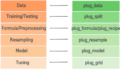
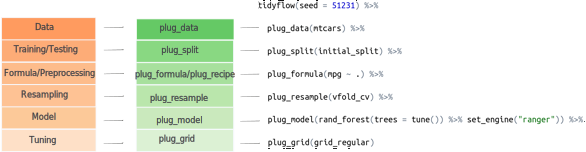

<style type="text/css">
code.r{
  font-size: 14px;
}
</style>

---
class: inverse, center, middle

# tidyflow: A simplified workflow for doing machine learning with tidymodels

### cimentadaj.github.io/tidyflow
### @cimentadaj
### 24th of September, 2020


```{r xaringan-themer, include=FALSE, warning=FALSE}
library(xaringanthemer)
style_mono_accent(
  base_color = "#1c5253",
  header_font_google = google_font("Josefin Sans"),
  text_font_google   = google_font("Montserrat", "300", "300i"),
  code_font_google   = google_font("Fira Mono")
)
```


```{r setup, include=FALSE}
library(knitr)
opts_chunk$set(echo = FALSE,
               out.width = "70%",
               fig.align = "center",
               eval = FALSE
               )
```

---

# tidymodels

.pull-left[
- <https://www.tidymodels.org/>

- Rewrite of `caret`

- Maturing (started circa 2017)

- Created with a `'tidy'` philosophy in mind

- Decouples caret into many packages:
  * `recipes`
  * `parsnip`
  * `rsample`
  * `yardstick`
  * ...
]

.pull-right[

```{r, echo = FALSE, fig.align = "center", out.width = "35%", dpi = 300}
knitr::include_graphics("../../../man/figures/tidymodels_hex.png")
```

]

---
class: center, middle

```{r, echo = FALSE, fig.align = "center", out.width = "35%", dpi = 300}

```
**I tried it out but it was too difficult for me**

<https://bit.ly/303EVuh>

---

# tidymodels

.pull-left[
```{r, echo = FALSE, out.width = "77%", dpi = 300}
knitr::include_graphics("../../../man/figures/tidymodels_code.png")
```
]

.pull-right[

* Data is repeated many times

* Different fit functions (`tune_*`, `fit`, `fit_resamples`, etc..)

* Non-linear workflow (workflow is defined after data, resampling, etc..)

* Too many objects to remember (predict by mistake on the test set, which `fit` function to use, etc...)

]

---

# tidyflow


* <https://cimentadaj.github.io/tidyflow/>

* `tidyflow` is a fork of `workflows` (`tidymodels`)

* It aims to create a higher level extension to `tidymodels`

* Bundles your data, splitting, resampling, preprocessing, modeling, and grid search in a single object.

<br>
<br>

You can install the package from Github (and also `tidymodels`):

```{r, eval = FALSE, echo = TRUE}
install.packages("tidymodels")

devtools::install_github("cimentadaj/tidyflow")
```

---

# tidyflow

```{r, out.width = "30%"}
knitr::include_graphics("../../../man/figures/stages.svg")
```

---

# tidyflow

```{r, out.width = "70%"}

```

---

# tidyflow

```{r, out.width = "95%"}

```

---

# tidyflow

```{r}
opts_chunk$set(echo = TRUE)
```

```{r, message = FALSE}
library(tidymodels)
library(tidyflow)

tflow <-
  mtcars %>%
  tidyflow(seed = 5213) %>%
  plug_split(initial_split) %>%
  plug_formula(mpg ~ .) %>%
  plug_model(linear_reg() %>% set_engine("lm"))

tflow
```

---

# tidyflow

```{r}
res <- fit(tflow)
res
```

---

# tidyflow

`tidyflow` leverages the power of `tidymodels` so we can continue to use the same infrastructure:

* `plug_split`: a function to be applied to the data such as `initial_split`, etc...

* `plug_formula`: the formula of the model definition. A tidyflow needs to specify either a formula or a recipe, but not both.

* `plug_recipe`: a formula containing a recipe that will be applied to the training data.

* `plug_resample`: a function to be applied to the preprocessed data such as `vfold_cv`, etc...

* `plug_grid`: a function to be applied to the tuning placeholders in the recipe or the data such as `grid_regular`, etc...

* `plug_model`: a model object such as `rand_forest`, etc...

---

# tidyflow

Let's work out a more complicated example based on the initial `tidymodels` example. Let's begin a reproducible tidyflow with the data, the split and the seed:

```{r}
library(AmesHousing)
library(tidymodels)
library(tidyflow)

ames <- make_ames()
tflow <- ames %>% tidyflow(seed = 52131) %>% plug_split(initial_split)
tflow
```

The `tidyflow` is currently only holding the data and the split.

---

# tidyflow

The `tidyflow` currently knows that it has a data frame and it will work solely once the training data set. Let's add a few transformations to the data with a recipe:

```{r}
mod_rec <-
  ~ recipe(Sale_Price ~ Longitude + Latitude + Neighborhood, data = .x) %>%
    step_other(Neighborhood, threshold = 0.05) %>%
    step_dummy(all_nominal())

tflow <- tflow %>% plug_recipe(mod_rec)
tflow
```

---

# tidyflow

Let's run a regularized regression where we grid search through the `penalty` and `mixture` hyper-parameters:

```{r}
reg_mod <- linear_reg(penalty = tune(), mixture = tune()) %>% set_engine("glmnet")

tflow <- tflow %>%
  plug_resample(vfold_cv) %>%
  plug_model(reg_mod) %>%
  plug_grid(grid_regular, levels = 5)

tflow
```

---

# tidyflow

```{r, message = FALSE}
res <- fit(tflow)
```

```{r, echo = FALSE, message = FALSE}
res %>% pull_tflow_fit_tuning()
```

---

# tidyflow

```{r, out.width = "43%", dpi = 300}
res %>% pull_tflow_fit_tuning() %>% autoplot() + facet_wrap(~ .metric, ncol = 2)
```

---

# tidyflow
We can allow `tidyflow` to find the best combination of parameters and quickly look at our metric of interest.

```{r}
final_mod <- res %>% complete_tflow(metric = "rmse")
multi_metric <- metric_set(rsq, rmse)

final_mod %>%
  predict_testing() %>%
  multi_metric(Sale_Price, .pred)
```

---

# tidyflow

Once you've fitted your `tidyflow`, you can begin extracting many of the separate parts:

* `pull_tflow_rawdata()`
* `pull_tflow_split()`
* `pull_tflow_training()`
* `pull_tflow_testing()`
* `pull_tflow_resample()`
* `pull_tflow_spec()`
* `pull_tflow_fit()`
* `pull_tflow_fit_tuning()`
* ...

---

# tidyflow

Resources:

* Several vignettes showcasing detailed functionalities: <https://cimentadaj.github.io/tidyflow/>

* My course notes 'Machine Learning for Social Scientists': <https://cimentadaj.github.io/ml_socsci/>

* Source code. Looking for collaborations, features, bugs or new ideas: <https://github.com/cimentadaj/tidyflow>

Road map:

* Grid of models

* `plug_metric` for evaluating custom metrics

* Including custom options for additional `tune_*` executions (`tune_bayes`, etc...)

---
class: center, middle

> Thanks to RStudio for supporting open source work and the `tidymodels` team for such a fresh infrastructure for doing tidy machine learning in R.

`r emo::ji("heart")`
